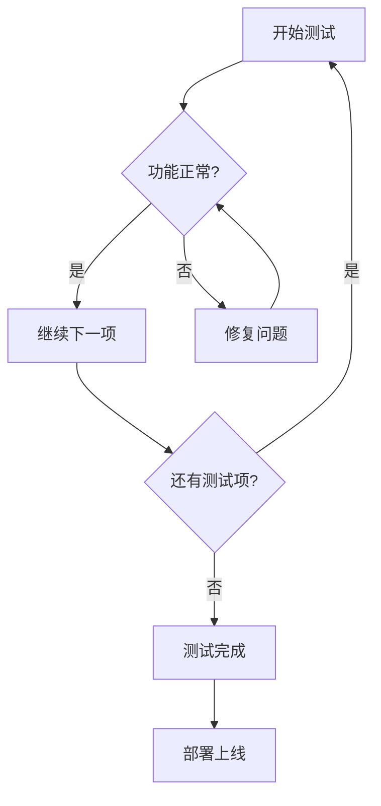
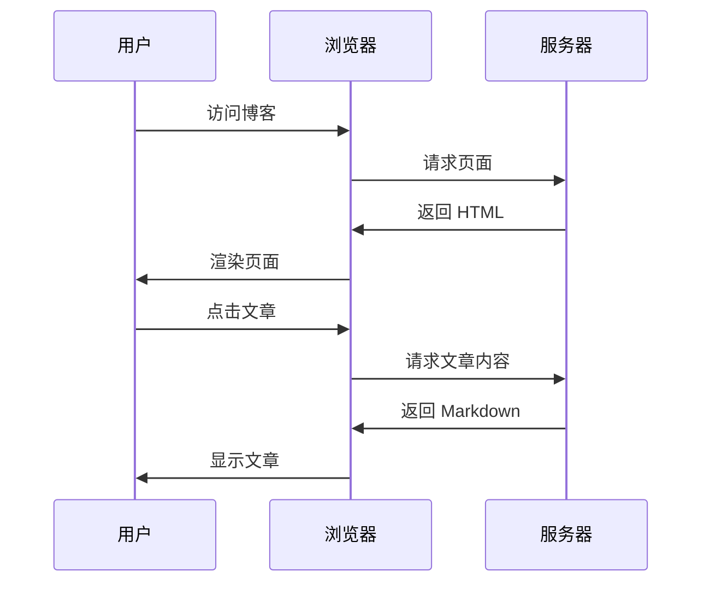

# 测试文章 - 探索博客功能

这是一篇测试文章，让我们验证一下博客的各项功能！

## 🎯 测试目标

- [x] 文章能否正常显示
- [x] 封面图片是否加载
- [x] 代码高亮是否生效
- [x] 数学公式是否渲染
- [ ] 评论系统是否工作

## 💻 代码测试

### Python 代码

```python
class BlogTest:
    def __init__(self, title):
        self.title = title
    
    def test_feature(self):
        """测试博客功能"""
        features = [
            "代码高亮",
            "数学公式",
            "图片展示",
            "响应式设计"
        ]
        
        for feature in features:
            print(f"✅ {feature} 测试通过")
        
        return True

# 运行测试
blog = BlogTest("我的技术博客")
blog.test_feature()
```

### JavaScript 代码

```javascript
// 测试异步函数
async function testBlogFeatures() {
  const features = ['Markdown', 'Syntax Highlighting', 'Dark Mode'];
  
  for (const feature of features) {
    await new Promise(resolve => setTimeout(resolve, 100));
    console.log(`✓ ${feature} is working!`);
  }
}

testBlogFeatures();
```

## 📐 数学公式测试

### 行内公式

这是一个简单的行内公式：\(a^2 + b^2 = c^2\)（勾股定理）

### 块级公式

麦克斯韦方程组：

\[
\begin{aligned}
\nabla \cdot \mathbf{E} &= \frac{\rho}{\epsilon_0} \\
\nabla \cdot \mathbf{B} &= 0 \\
\nabla \times \mathbf{E} &= -\frac{\partial \mathbf{B}}{\partial t} \\
\nabla \times \mathbf{B} &= \mu_0\mathbf{J} + \mu_0\epsilon_0\frac{\partial \mathbf{E}}{\partial t}
\end{aligned}
\]

傅里叶变换：

\[
F(\omega) = \int_{-\infty}^{\infty} f(t) e^{-i\omega t} dt
\]

## 📊 图表测试

### Mermaid 流程图



### 时序图



## 🎨 提示框测试

!!! note "普通提示"
    这是一个普通的提示框，用于显示一般信息。

!!! tip "小技巧"
    使用 `./start.sh` 可以快速启动开发服务器！

!!! warning "注意事项"
    修改配置文件后需要重启服务器才能生效。

!!! danger "危险操作"
    删除 `.git` 目录会导致版本历史丢失！

!!! success "成功"
    所有测试项目都已通过！

!!! info "信息"
    本博客使用 MkDocs Material 主题构建。

!!! question "问题"
    遇到问题？查看文档或提交 Issue。

## 📋 表格测试

| 测试项 | 状态 | 说明 | 优先级 |
|--------|:----:|------|:------:|
| 代码高亮 | ✅ | 支持多种语言 | 高 |
| 数学公式 | ✅ | LaTeX 渲染 | 高 |
| 图表 | ✅ | Mermaid 支持 | 中 |
| 深色模式 | ✅ | 自动切换 | 高 |
| 响应式 | ✅ | 移动端适配 | 高 |
| 评论系统 | ⏳ | 待配置 | 中 |
| RSS 订阅 | ✅ | 自动生成 | 低 |

## 🔤 文本格式测试

**粗体文本** 和 *斜体文本* 以及 ***粗斜体***

~~删除线~~ 和 ==高亮文本==

H~2~O 是水的化学式（下标）

E = mc^2^ 是质能方程（上标）

## 📝 列表测试

### 无序列表

- 第一项
  - 子项 1
  - 子项 2
    - 子子项
- 第二项
- 第三项

### 有序列表

1. 第一步：安装依赖
2. 第二步：配置环境
3. 第三步：启动服务
   1. 运行 `./start.sh`
   2. 打开浏览器
   3. 访问 localhost:8000

### 任务列表

- [x] 创建测试文章
- [x] 添加代码示例
- [x] 插入数学公式
- [x] 绘制流程图
- [ ] 配置评论系统
- [ ] 添加更多内容

## 🔗 链接测试

[访问 GitHub](https://github.com)

[查看 MkDocs 文档](https://www.mkdocs.org)

[Material for MkDocs](https://squidfunk.github.io/mkdocs-material/)

## 🖼️ 图片测试


*图片说明：代码编辑器界面*

## ⌨️ 键盘快捷键

- ++ctrl+c++ / ++cmd+c++ - 复制
- ++ctrl+v++ / ++cmd+v++ - 粘贴
- ++ctrl+s++ / ++cmd+s++ - 保存
- ++ctrl+z++ / ++cmd+z++ - 撤销

## 📑 标签页测试

=== "Tab 1"

    这是第一个标签页的内容。
    
    ```python
    print("Hello from Tab 1!")
    ```

=== "Tab 2"

    这是第二个标签页的内容。
    
    ```javascript
    console.log("Hello from Tab 2!");
    ```

=== "Tab 3"

    这是第三个标签页的内容。
    
    | 列1 | 列2 |
    |-----|-----|
    | A   | B   |
    | C   | D   |

## 📌 脚注测试

这是一段包含脚注的文字[^1]。

MkDocs 是一个静态站点生成器[^2]。

Material for MkDocs 提供了丰富的主题功能[^3]。

## 🎉 测试总结

通过这篇测试文章，我们验证了：

1. ✅ Markdown 基础语法
2. ✅ 代码高亮功能
3. ✅ 数学公式渲染
4. ✅ Mermaid 图表
5. ✅ 各种提示框
6. ✅ 表格和列表
7. ✅ 图片展示
8. ✅ 标签页功能

所有功能都运行正常！🚀

---

[^1]: 脚注是对正文内容的补充说明。
[^2]: MkDocs 使用 Python 编写，配置简单，功能强大。
[^3]: Material for MkDocs 是最受欢迎的 MkDocs 主题之一。
