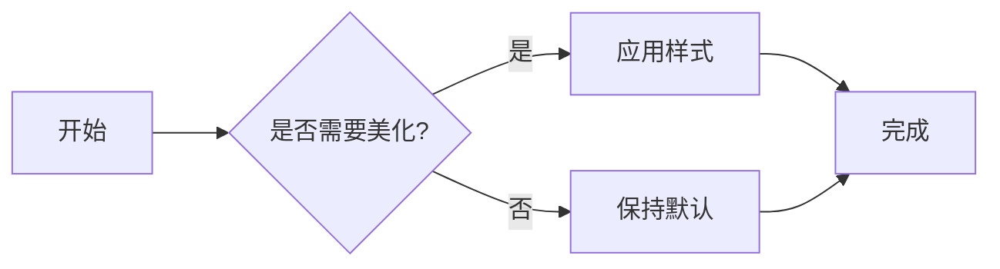

# 欢迎来到我的博客

这是一篇示例文章，展示这个博客系统的各种 Markdown 功能和美化效果。

## 代码高亮

支持多种编程语言的语法高亮：

```python
def fibonacci(n: int) -> int:
    """计算斐波那契数列的第 n 项"""
    if n <= 1:
        return n
    return fibonacci(n - 1) + fibonacci(n - 2)

# 使用示例
result = fibonacci(10)
print(f"第 10 项斐波那契数是: {result}")
```

```javascript
// JavaScript 示例
const greet = (name) => {
  console.log(`Hello, ${name}!`);
};

greet('World');
```

## 数学公式

支持 LaTeX 数学公式渲染：

行内公式：质能方程 \(E = mc^2\) 是物理学中最著名的公式之一。

块级公式：

\[
\int_{-\infty}^{\infty} e^{-x^2} dx = \sqrt{\pi}
\]

欧拉公式：

\[
e^{i\pi} + 1 = 0
\]

## 提示框

!!! note "提示"
    这是一个提示框，用于强调重要信息。

!!! tip "小技巧"
    你可以使用不同类型的提示框来组织内容。

!!! warning "警告"
    这是一个警告框，用于提醒注意事项。

!!! danger "危险"
    这是一个危险提示框，用于标记高风险操作。

!!! success "成功"
    这是一个成功提示框。

!!! info "信息"
    这是一个信息提示框。

## 任务列表

- [x] 搭建博客框架
- [x] 配置主题和插件
- [x] 创建示例文章
- [x] 美化样式
- [ ] 添加更多内容
- [ ] 分享给朋友

## 表格

| 功能 | 支持 | 说明 |
|------|:----:|------|
| 代码高亮 | ✅ | 支持多种语言 |
| 数学公式 | ✅ | LaTeX 语法 |
| 图片灯箱 | ✅ | 点击放大 |
| 深色模式 | ✅ | 自动切换 |
| 响应式设计 | ✅ | 移动端友好 |
| 评论系统 | ✅ | GitHub Issues |

## Mermaid 图表



## 标签页

=== "Python"

    ```python
    print("Hello from Python!")
    ```

=== "JavaScript"

    ```javascript
    console.log("Hello from JavaScript!");
    ```

=== "Rust"

    ```rust
    fn main() {
        println!("Hello from Rust!");
    }
    ```

## 键盘快捷键

使用 ++ctrl+c++ 复制，++ctrl+v++ 粘贴。

在 Mac 上使用 ++cmd+c++ 和 ++cmd+v++。

## 脚注

这是一段包含脚注的文字[^1]，你可以在页面底部看到脚注内容。

这是另一个脚注[^2]。

## 开始写作

在 `docs/blogs/posts/` 目录下创建新的 Markdown 文件即可开始写作。每篇文章需要包含 front-matter：

```yaml
---
title: 文章标题
description: 文章简介
date: 2025-04-30
tags:
  - 标签1
  - 标签2
cover: 封面图片URL（可选）
---
```

祝你写作愉快！🎉

[^1]: 这是第一个脚注的内容。
[^2]: 这是第二个脚注的内容，可以包含更多详细信息。
