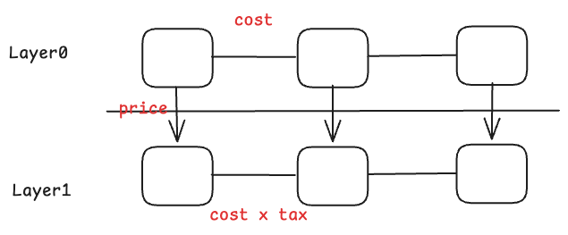

# 周赛 501

## Q4. 购买苹果的最小花费

> https://leetcode.cn/contest/weekly-contest-501/problems/minimum-cost-to-buy-apples-ii/description/

### 题目描述

给定一个整数 $n$ 和一个长度为 $n$ 的整数数组 $\text{prices}$，其中 $\text{prices}[i]$ 表示商店 $i$ 中苹果的价格。

另给定一个二维整数数组 $\text{roads}$，其中 $\text{roads}[i] = [u_i,\; v_i,\; \text{cost}_i,\; \text{tax}_i]$ 表示一条**双向**道路：

- $u_i$ 和 $v_i$ 是该道路连接的两个商店；
- $\text{cost}_i$ 表示**空手**（不携带苹果）通过该道路的花费；
- $\text{tax}_i$ 表示**携带苹果**时的费用乘数，即实际花费为 $\text{cost}_i \times \text{tax}_i$。

### 规则

对于每个商店 $i$，可以选择以下两种策略之一：

1. **就地购买**：直接在商店 $i$ 购买苹果，花费为 $\text{prices}[i]$。
2. **异地购买**：

- 以空手状态，经过任意数量的道路前往某家商店 $j$；

- 以 $\text{prices}[j]$ 的价格购买苹果；
- 携带苹果返回商店 $i$，返回途中每条道路的费用为 $\text{cost} \times \text{tax}$。

!!! note "注意"
	前往商店（空手）和返回（携带苹果）所经过的路径**可以不同**。

### 返回值

返回一个长度为 $n$ 的整数数组 $\text{ans}$，其中 $\text{ans}[i]$ 表示从商店 $i$ 出发购买苹果所需的**最小总花费**。

### 思路

本质是一个**双权图上的最短路**问题。

建立两张图：

- **空手图** $G_1$：边权为 $\text{cost}$
- **负重图** $G_2$：边权为 $\text{cost} \times \text{tax}$

设：

- $d_1(i, j)$ 为从节点 $i$ 空手到达节点 $j$ 的最短路径长度；
- $d_2(i, j)$ 为从节点 $i$ 携带苹果到达节点 $j$ 的最短路径长度。

由于是**无向图**，$d_2(i, j) = d_2(j, i)$，因此从 $j$ 带苹果回到 $i$ 的最短路 = 从 $i$ 带苹果到 $j$ 的最短路。

则答案为：

$$
\text{ans}[i] = \min_{j \in [0, n)} \left\{ d_1(i, j) + \text{prices}[j] + d_2(i, j) \right\}
$$

---

### 解法一：分层图建模

将问题建模为**分层图**：

- **层 0**（节点 $0 \sim n-1$）：空手状态
- **层 1**（节点 $n \sim 2n-1$）：携带苹果状态
- **层内边**：
    - 层 0：边 $(u, v)$ 权重 $\text{cost}$
    - 层 1：边 $(u+n, v+n)$ 权重 $\text{cost} \times \text{tax}$
- **跨层边**：$(j, j+n)$ 权重 $\text{prices}[j]$（在 $j$ 购买苹果）

对每个起点 $i$，答案即从节点 $i$ 到节点 $i+n$ 的最短路。



```python
import heapq
from collections import defaultdict
from math import inf

def minCost(n, prices, roads):
    # 建分层图
    graph = defaultdict(list)
    for u, v, cost, tax in roads:
        # 空手层
        graph[u].append((v, cost))
        graph[v].append((u, cost))
        # 携带层
        graph[u + n].append((v + n, cost * tax))
        graph[v + n].append((u + n, cost * tax))
    # 跨层边：在 j 购买苹果
    for j in range(n):
        graph[j].append((j + n, prices[j]))

    ans = []
    for i in range(n):
        price_i = prices[i]
        dist = [inf] * (2 * n)
        dist[i] = 0
        pq = [(0, i)]

        while pq:
            d, u = heapq.heappop(pq)
            if d > dist[u]:
                continue
            # 剪枝：距离超过本地价格则不再扩展
            if d >= price_i:
                continue

            for v, w in graph[u]:
                nd = d + w
                if nd < dist[v]:
                    dist[v] = nd
                    heapq.heappush(pq, (nd, v))

        ans.append(dist[i + n])
    return ans
```

**复杂度**：

- 时间：$O(n \cdot (n + m) \log n)$
- 空间：$O(n + m)$

---

### 解法二：双图 + 对称性

利用**无向图的对称性**，直接在原图上操作。

对每个起点 $i$，分别在 $G_1$ 和 $G_2$ 上跑 Dijkstra：

- `dis1[j]`：从 $i$ 空手到 $j$ 的最短路
- `dis2[j]`：从 $i$ 带苹果到 $j$ 的最短路 = 从 $j$ 带苹果回 $i$ 的最短路

答案枚举所有购买点 $j$：

$$
\text{ans}[i] = \min_{j} \{ \text{dis1}[j] + \text{prices}[j] + \text{dis2}[j] \}
$$

```python
from heapq import heappop, heappush
from math import inf

def shortestPathDijkstra(g: list[list[tuple[int, int]]], start: int, price: int) -> list[int]:
    dis = [inf] * len(g)
    dis[start] = 0
    h = [(0, start)]

    while h:
        dis_x, x = heappop(h)
        if dis_x > dis[x]:
            continue
        for y, wt in g[x]:
            new_dis_y = dis_x + wt
            if new_dis_y < price and new_dis_y < dis[y]:  # 剪枝
                dis[y] = new_dis_y
                heappush(h, (new_dis_y, y))

    return dis

class Solution:
    def minCost(self, n: int, prices: list[int], roads: list[list[int]]) -> list[int]:
        g1 = [[] for _ in range(n)]
        g2 = [[] for _ in range(n)]
        for x, y, cost, tax in roads:
            g1[x].append((y, cost))
            g1[y].append((x, cost))
            g2[x].append((y, cost * tax))
            g2[y].append((x, cost * tax))

        ans = [0] * n
        for i, price in enumerate(prices):
            dis1 = shortestPathDijkstra(g1, i, price)
            dis2 = shortestPathDijkstra(g2, i, price)
            ans[i] = min(p + d1 + d2 for p, d1, d2 in zip(prices, dis1, dis2))
        return ans
```

**复杂度**：

- 时间：$O(n \cdot (n + m) \log n)$
- 空间：$O(n + m)$

---

### 两种解法对比

#### 符号说明

- $n$：图中的**节点数**（本题中为商店数量）
- $m$：图中的**边数**（本题中为道路数量）

#### Dijkstra 时间复杂度分析

单次 Dijkstra 的时间复杂度为 $O((n + m) \log n)$：

- **初始化**：$O(n)$，初始化距离数组
- **堆操作**：
    - 每个节点最多入堆一次：$n$ 次 `push`
    - 每条边最多松弛一次：$m$ 次 `push`
    - 总共最多 $n + m$ 次堆操作，每次 $O(\log n)$
- **总时间**：$O((n + m) \log n)$

#### 两种解法的实际差异

| 方案 | 单次 Dijkstra 规模 | 调用次数 | 总时间复杂度 |
|------|------------------|---------|-------------|
| 分层图 | 图有 $2n$ 个节点，$2m + n$ 条边 | 每个起点 1 次 | $O(n \cdot (3n + 2m) \log(2n))$ |
| 双图对称 | 图有 $n$ 个节点，$m$ 条边 | 每个起点 2 次 | $O(2n \cdot (n + m) \log n)$ |

化简后（忽略低阶项和常数）：

- **分层图**：$O(n(n + m) \log n)$
- **双图对称**：$O(n(n + m) \log n)$

**结论**：渐进复杂度相同。实际运行时，双图的常数更小，但差异不大。加上剪枝后，两者性能接近。

#### 建模方式对比

| 方案 | 建模方式 | 代码复杂度 | 适用场景 |
|------|---------|-----------|---------|
| 分层图 | 显式建立状态转移图 | 稍复杂 | 适合理解问题本质，易扩展到多状态问题 |
| 双图对称 | 利用无向图性质 | 简洁 | 代码更直观，适合竞赛快速实现 |
